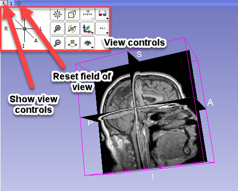

!!! warning
	Ensure you are using <a href="https://download.slicer.org/" target="_blank">**3D Slicer 4.11**</a>

## Interface Overview

Slicer stores all loaded data in a data repository, called the “scene” (or Slicer scene or MRML scene). Each data set, such as an image volume, surface model, or point set, is represented in the scene as a “node”.

Slicer provides a large number “modules”, each implementing a specific set of functions for creating or manipulating data in the scene. Modules typically do not interact with each other directly: they just all operate on the data nodes in the scene. Slicer package contains over 100 built-in modules and additional modules can be installed by using the Extension Manager.

   

### 2D Views

Three default slice views are provided (with Red, Yellow and Green colored bars) in which Axial, Saggital, Coronal or Oblique 2D slices of volume images can be displayed. Additional generic slice views have a grey colored bar and an identifying number in their upper left corner.

Slice View Controls: The colored bar across any Slice View shows a pushpin icon on its left. When the mouse rolls over this icon, a panel for configuring the slice view is displayed. The panel is hidden when the mouse moves away. For persistent display of this panel, just click the pushpin icon. For more options, click the double-arrow icon.

View Controllers module provides an alternate way of displaying these controllers in the Module Panel.

- **Reset field of view** (small square) centers the slice on the current background volume
- **Link** button synchronizes properties (which volumes are displayed, zoom factor, position of parallel views, opacities, etc.) between all slice views in the same view group. Long-click on the button exposes **hot-linked** option, which controls when properties are synchronized (immediately or when the mouse button is released).
- **Eye** button in the top row can show the current slice in 3D views. Drop-down menu of the button contains advanced options to customize how this slice is rendered: "...match volume" means that the properties are taken from the full volume, while "...match 2D" means that the properties are copied from the current slice view (for example, copies zoom and pan position). Typically these differences are subtle and the settings can be left at default.
- **Orientation Selection** displays allows you to choose the orientation for this slice view.
- **Lightbox** to select a mosiac (a.k.a. contact sheet) view.  Not all operations work in this mode and it may be removed in the future.
- **Reformat** allows interactive manipulation of the slice orientation.
- **Blending options** how foreground and background layers are mixed.
- **Spacing and Field of View** Spacing defines the increment for the slice offset slider.  Field of view sets the zoom level for the slice.
- **Rotate to Volume Plane** changes the orientation of the slice to match the closest acquisition orientation of the displayed volume
- **Show Orientation Marker** controls display of human, cube, etc in lower right corner
- **Ruler** controls display of ruler in slice view

### 3D View

Displays a rendered 3D view of the scene along with visual references to specify orientation and scale.

Default orientation axes:

- A = anterior; P = posterior
- R = right; L = left
- S = superior; I = inferior

3D View Controls: The blue bar across any 3D View shows a pushpin icon on its left. When the mouse rolls over this icon, a panel for configuring the 3D View is displayed. The panel is hidden when the mouse moves away. For persistent display of this panel, just click the pushpin icon.

## Mouse & Keyboard Shortcuts

The following summary of shortcuts is taken from the <a href="https://slicer.readthedocs.io/en/latest/user_guide/user_interface.html" target="_blank">3D Slicer documentation</a>. 

!!! note
    The shortcuts are working on any stable 3D Slicer version >=4.10.0

### Generic shortcuts

| Shortcut | Operation |
| -------- | --------- |
| `Ctrl` + `f` | find module by name (hit `Enter` to select) |
| `Ctrl` + `a` | add data from file |
| `Ctrl` + `o` | add data from file |
| `Ctrl` + `s` | save data to files |
| `Ctrl` + `w` | close scene |
| `Ctrl` + `0` | show Error Log |
| `Ctrl` + `1` | show Application Help |
| `Ctrl` + `2` | show Application Settings |
| `Ctrl` + `3` | show/hide Python Interactor |
| `Ctrl` + `4` | show Extension Manager |
| `Ctrl` + `5` | show/hide Module Panel |
| `Ctrl` + `h` | open default startup module (configurable in Application Settings) |

### 2D Views

The following shortcuts are available when a slice view is active. To activate a view, click inside the view: if you do not want to change anything in the view, just activate it then do `right-click` without moving the mouse. Note that simply hovering over the mouse over a slice view will not activate the view.

| Shortcut | Operation |
| -------- | --------- |
| `right-click` + `drag up/down` | zoom image in/out |
| `left-click` + `drag up/down` | adjust level of image |
| `left-click` + `drag left/right` | adjust window of image |
| `Ctrl` + `mouse wheel` | zoom image in/out |
| `middle-click` + `drag` | pan (translate) view |
| `Shift` + `left-click` + `drag` | pan (translate) view |
| `left arrow` / `right arrow` | move to previous/next slice |
| `b` / `f` | move to previous/next slice |
| `Shift` + `mouse move` | move crosshair in all views |
| `v` | toggle slice visibility in 3D view |
| `r` | reset zoom and pan to default |
| `g` | toggle segmentation or labelmap volume | | | visibility |
| `t` | toggle foreground volume visibility |
| `[` / `]` | use previous/next volume as background |
| `{` / `}` | use previous/next volume as foreground |

### 3D views

The following shortcuts are available when a 3D view is active. To activate a view, click inside the view: if you do not want to change anything in the view, just activate it then do `right-click` without moving the mouse. Note that simply hovering over the mouse over a slice view will not activate the view.

| Shortcut | Operation |
| -------- | --------- |
| `Shift` + `mouse move` | move crosshair in all views |
| `left-click` + `drag` | rotate view |
| `left arrow` / `right arrow`  | rotate view |
| `up arrow` / `down arrow` | rotate view |
| `End` or `Keypad 1` | rotate to view from anterior |
| `Shift` + `End` or `Shift` + `Keypad 1` | rotate to view from posterior |
| `Page Down` or `Keypad 3` | rotate to view from left side |
| `Shift` + `Page Down` or `Shift` + `Keypad 3` | rotate to view from right side |
| `Home` or `Keypad 7` | rotate to view from superior |
| `Shift` + `Home` or `Shift` + `Keypad 7`| rotate to view from inferior |
| `right-click` + `drag up/down` | zoom view in/out |
| `Ctrl` + `mouse wheel` | zoom view in/out |
| `+` / `-` | zoom view in/out |
| `middle-click` + `drag` | pan (translate) view |
| `Shift` + `left-click` + `drag` | pan (translate) view |
| `Shift` + `left arrow` / `Shift` + `right arrow` | pan (translate) view |
| `Shift` + `up arrow` / `Shift` + `down arrow` | pan (translate) view |
| `Shift` + `Keypad 2` / `Shift` + `Keypad 4` | pan (translate) view |
| `Shift` + `Keypad 6` / `Shift` + `Keypad 8` | pan (translate) view |
| `Keypad 0` or `Insert` | reset zoom and pan, rotate to nearest standard view |

