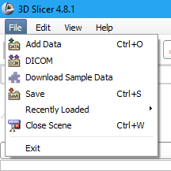
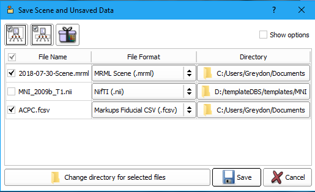
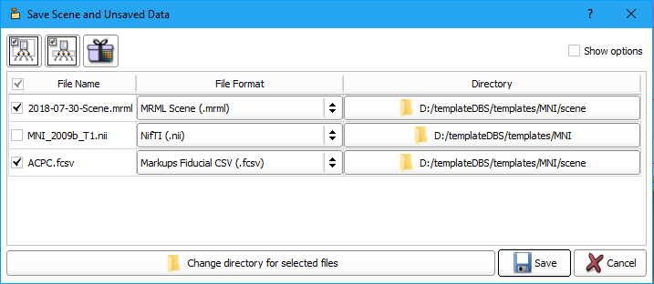
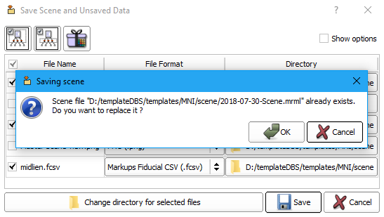
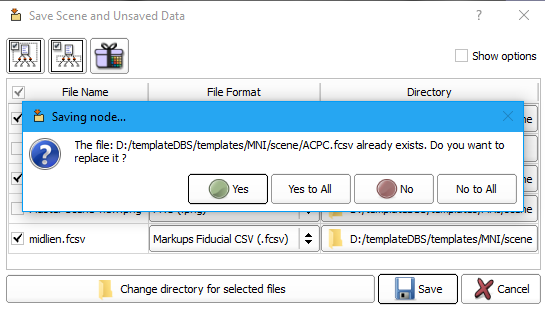

!!! warning
	Ensure you are using <a href="https://download.slicer.org/" target="_blank">**3D Slicer 4.11**</a>

## Walkthrough

1. Click on the **File** menu at the top.
	
	

	    <figure>
	        
	        <figcaption>3D Slicer file menu.</figcaption>
	    </figure>
	

2. Choose **Save**, the dialog box shown below will appear:

	

	    <figure>
	        
	        <figcaption>3D Slicer file menu.</figcaption>
	    </figure>
	

3. If this is your first time saving you will have to define the directory to save the files. Click on **Change directory for selected files**. The dialog box below will appear:

	

	    <figure>
	        
	        <figcaption>3D Slicer file menu.</figcaption>
	    </figure>
	

4. Find the directory where you want to save the data, create a new folder called **[VolumeID]\_scene** and then double click on it so you are now within the directory. Select **Choose**.

5. You will now notice that the **.nii** file is de-selected and is in the original directory location. All the other files you will be saving are in the newly created **[VolumeID]\_scene** folder. Click **Save**.

	

	    <figure>
	        
	        <figcaption>3D Slicer file menu.</figcaption>
	    </figure>
	

6. If this not your first time saving you will see two warning messages. The first will notify you that the **.mrml** file already exists and ask if you want to replace it. Click **OK**.

	

	    <figure>
	        
	        <figcaption>3D Slicer file menu.</figcaption>
	    </figure>
	

7. A second warning message will appear letting you know that the **.fcsv** file already exists and ask if you would like to replace it. Click **Yes to All**. This will overwrite your old datafiles with the newer ones.

	

	    <figure>
	        
	        <figcaption>3D Slicer file menu.</figcaption>
	    </figure>
	

	
8.	To close the current scene, before opening a new subject, click the **File** menu and select **Close Scene**.

	

	    <figure>
	        
	        <figcaption>3D Slicer file menu.</figcaption>
	    </figure>
	

 
 
 
