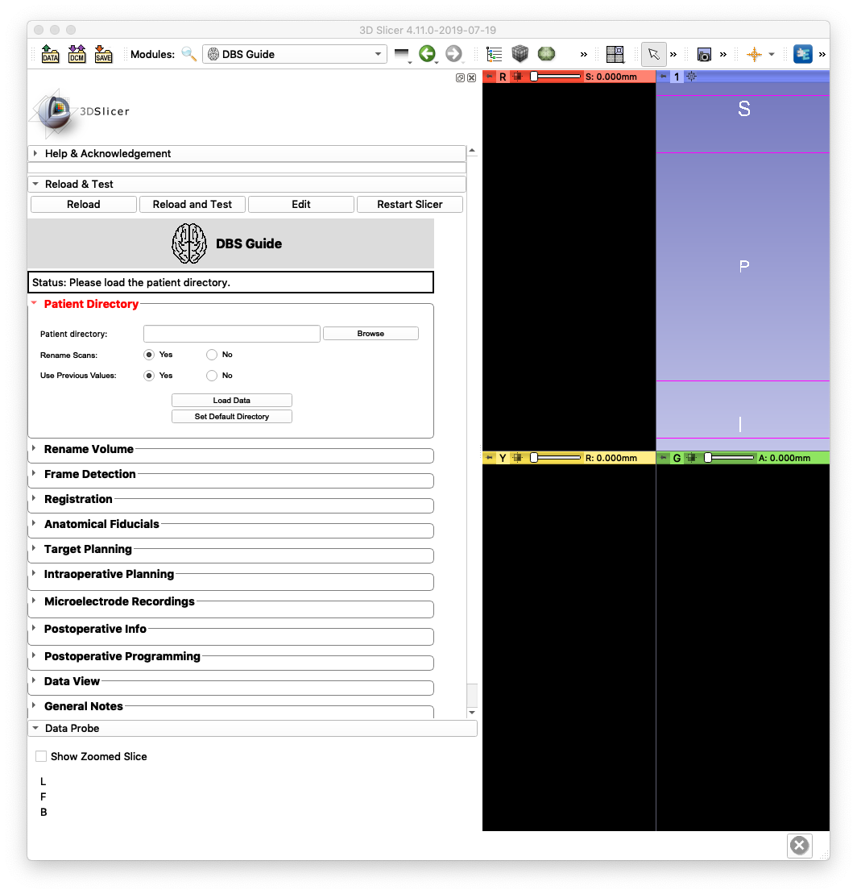

## What is DBS?
-------------------
DBS, short for Deep Brain Stiumation, is an established surgical treatment for people with movement disroders, such as Parkinson's disease and dystonia. It involves implanting electrodes (thin metal wires) within certain areas of the brain and sending electrical impulses to the brain through these electrodes. The electrical impulses are controlled a device that's implanted by the chest.

Diagram from: https://mayfieldclinic.com/pe-dbs.htm

Learn more about deep brain stimulation <a href="https://mayfieldclinic.com/pe-dbs.html" target="_blank">here</a>

## What is DBS Guide?
--------------------
**DBS Guide** is a surgical planning, visuazliation, and postoperative assessment tool used for deep brain stimulation. It provides capabilities across the entire surgical spectrum:

1. Pre-operative
   - Co-registration of MRI scans with 3D volumetric stealth MRI
   - Planning DBS lead trajectory

2. Intra-operative
   - Co-restration of frame CT with MRI 
   - Confirmation of frame fiducials using automated frame detection (DBS Guide identifies the frame fiducials using image recognition)
   - Determining accuracy of (x,y,z) coordinates, arc and ring angles
   - Mapping of microelectrode (MER) recordings and plotting them in patient brain anatomy
   - Saving information regarding the trajectory used (medial, lateral, etc.) and other lead implant specs (e.g. depth)

3. Post-operative
      - Co-registration of post-op CT with pre-op MRI 
      - Visualization of implanted electrodes with high accuracy
      - Manipulation of stimulation settings 
      - Volume tissue activation model based on stimulation settings

## What is 3D Slicer?
-------------------

3D Slicer is an open-source software platform for medical image informatics, image processing, and 3D visualization. Built over two decades through support from the National Institutes of Health and a worldwide developer community, Slicer brings free, powerful cross-platform (Linux, MacOSX, and Windows) processing tools to physicians, researchers, and the general public.

### 3D Slicer Features
Multi-organ: from head to toe Support for multi-modality imaging including: MRI, CT, US, nuclear medicine, and microscopy Bidirectional interface for devices

## Sources

* https://slicer.org
* https://www.slicer.org/wiki/Main_Page
* Fedorov A., Beichel R., Kalpathy-Cramer J., Finet J., Fillion-Robin J-C., Pujol S., Bauer C., Jennings D., Fennessy F., Sonka M., Buatti J., Aylward S.R., Miller J.V., Pieper S., Kikinis R. `3D Slicer as an Image Computing Platform for the Quantitative Imaging Network <https://www.ncbi.nlm.nih.gov/pmc/articles/PMC3466397/>`_. Magnetic Resonance Imaging. 2012 Nov;30(9):1323-41. PMID: 22770690.

  