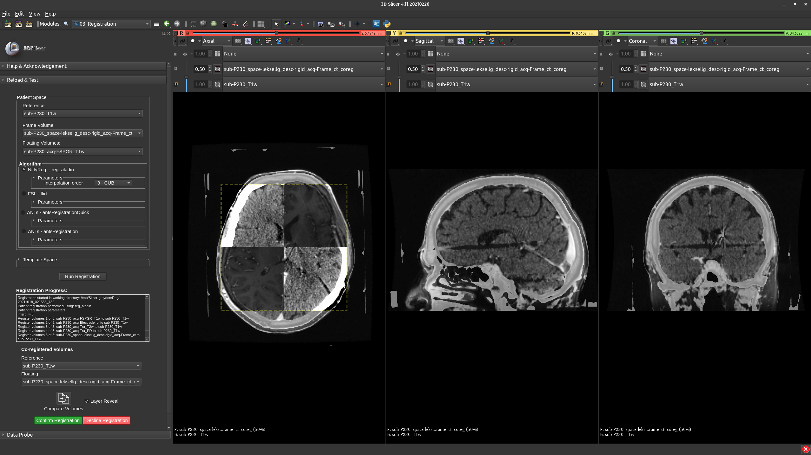
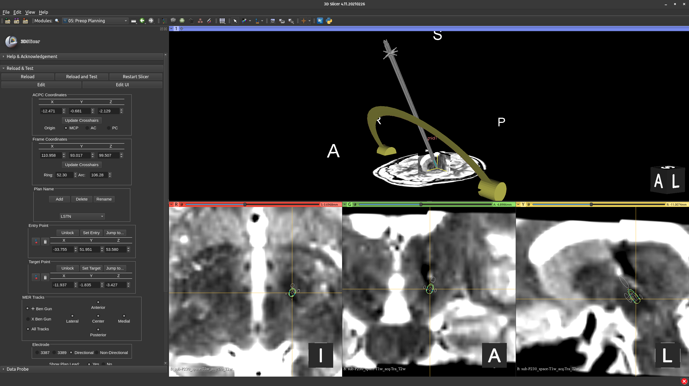

<em>An open-source software for neurosurgical trajectory planning, visualization, and postoperative assessment</em>

---

What is trajectoryGuide?

**trajectoryGuide** provides the capability to plan surgical trajectories within 3D Slicer, an open-source medical imaging software. trajectoryGuide contains modules that span the three phases of neurosurgical trajectory planning:

## Preoperative features
   
* automatic stereotactic frame detection (supported frames: Leksell, BRW, and CRW)
* co-registration of MRI and CT scans (incorporated registration algorithms: ANTS, FSL, or NiftyReg)
* trajectory planning providing coordinates in anatomical and stereotactic space (including arc, ring angles)
      

## Perioperative features

* update final electrode position based on intra-operative testing
* display microelectrode recordings (MER) within the patients MRI space

## Postoperative features

* electrode localization (using post-op imaging)
* visualize stimulation settings as volume of activated tissue
* view data within a template space (provided spaces: MNI152NLin2009bAsym, MNI152NLin2009cAsym, and PD25)

   