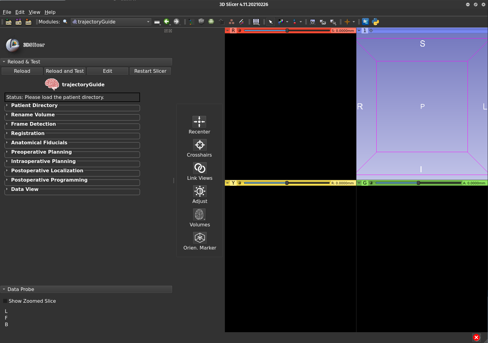

<em>An open-source software for neurosurgical surgical trajectory planning, visualization, and postoperative assessment</em>

---

**trajectoryGuide** provides the capability to plan surgical trajectories within 3D Slicer, an open-source medical imaging software. trajectoryGuide contains modules that span the three phases of neurosurgical trajectory planning:

1. **Pre-operative**
   
      - automatic stereotactic frame detection (supported frames: Leksell, BRW)
      - co-registration of MRI scans with 3D volumetric stealth MRI
      
         

      
      - trajectory planning providing coordinates in anatomical and frame space (including arc, ring angles)

2. **Intra-operative**

      - update final electrode position based on intra-operative testing
      - display microelectrode recordings (MER) within the patients MRI space

3. **Post-operative**

      - co-registration of post-op imaging (CT or MRI)
      - visualization of implanted electrodes (planned, intra-op update, and post-op location)
      - visualize stimulation settings as volume of tissues activated fields
      - view data within a template space (default is MNI space)

   