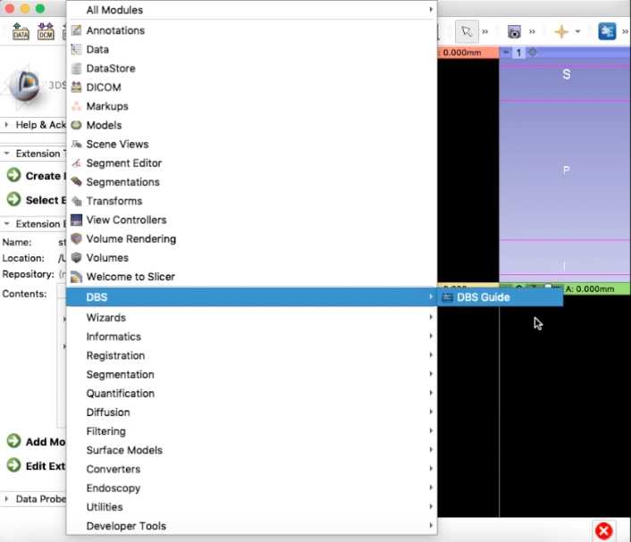

## Requirements

1. **3D Slicer**
    - 3D Slicer **(Version 4.11.0 or later)**, Download here: https://download.slicer.org/

2. **trajectoryGuide source code**
    - download the latest version of trajectoryGuide

    Unzip the folder and save it somewhere on your system. For this tutorial, the file
    has been saved in Desktop.

## Loading trajectoryGuide into 3D Slicer

1. Open 3D Slicer

    It should look like this (if you have/don't have a Python Interactor 
    at the bottom, that is fine)

    

2. Load **trajectoryGuide** module

    On the top menu bar next to "**Modules**", 
    select the drop down menu and go to "**Developer Tools**", then select "**Extension Wizard**." 
    Under Extension Tools, press "**Select Extension.**" 

    

    Select the trajectoryGuide-master folder and open it

    

3. Pop-up Window

    A window will pop up. Make sure both options are selected and press yes. 

    

 

    The **trajectoryGuide** module is now apart of Slicer.
      

4. Open **trajectoryGuide** in Slicer

    To open it, go to the modules drop down menu
    and select trajectoryGuide -> trajectoryGuide

    

    You have now successfully loaded trajectoryGuide into Slicer. Your screen should look like this:

    

5. Reopening Slicer/trajectoryGuide

    The next time you open Slicer, you don't have to go through the Extension Wizard. **trajectoryGuide** 
    will be included in Slicer's modules. You may open **trajectoryGuide** straight from the Modules
    drop down menu (**all you have to do is step 4 next time**)

 
 
 