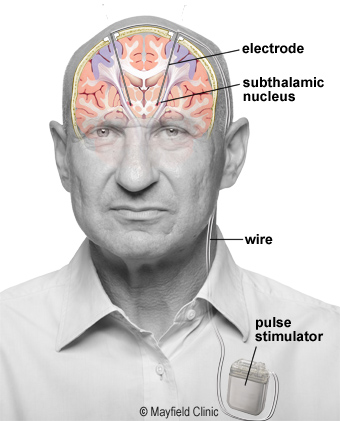
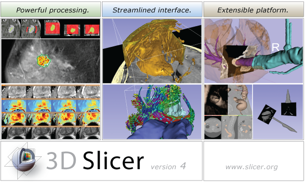

## What is DBS?

Deep Brain Stimulation (DBS), is an established neurosurgical treatment for individuals living with a movement disorder, such as Parkinsons disease. The surgical process involves chronic implantation of stimulation electrodes within specific areas of the brain. The electrodes send electrical impulses to the brain to alleviate motor symptoms associated with the movement disorder.

    <figure>
    
    <figcaption>Diagram from: https://mayfieldclinic.com/pe-dbs.htm</figcaption>
    </figure>

Learn more about deep brain stimulation <a href="https://mayfieldclinic.com/pe-dbs.html" target="_blank">here</a>.

 

## What is trajectoryGuide?

**trajectoryGuide** is an open-source software suite that provides the capability to plan neurosurgical trajectories within 3D Slicer. **trajectoryGuide** contains several modules that span the three phases of surgical intervention: pre-op, intra-op, and post-op.

## What is 3D Slicer?

3D Slicer is an open-source software platform for medical image informatics, image processing, and 3D visualization. Slicer brings free, powerful cross-platform (Linux, MacOSX, and Windows) processing tools to physicians, researchers, and the general public.

### 3D Slicer Features

Multi-organ: from head to toe Support for multi-modality imaging including: MRI, CT, US, nuclear medicine, and microscopy Bidirectional interface for devices

## Sources

* https://slicer.org
* https://www.slicer.org/wiki/Main_Page
* Fedorov A., Beichel R., Kalpathy-Cramer J., Finet J., Fillion-Robin J-C., Pujol S., Bauer C., Jennings D., Fennessy F., Sonka M., Buatti J., Aylward S.R., Miller J.V., Pieper S., Kikinis R. `3D Slicer as an Image Computing Platform for the Quantitative Imaging Network <https://www.ncbi.nlm.nih.gov/pmc/articles/PMC3466397/>`_. Magnetic Resonance Imaging. 2012 Nov;30(9):1323-41. PMID: 22770690.

 
 
 