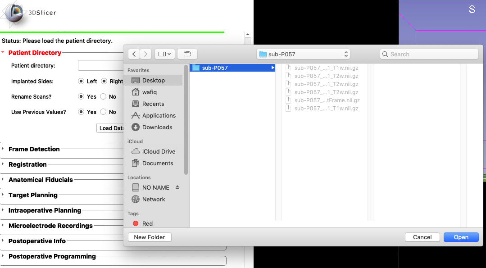

Once you've loaded trajectoryGuide into Slicer (see <a href="https://github.com/trajectoryGuide/widgets/installation.html" target="_blank">installation instructions</a>), you can begin using trajectoryGuide. The first step is to load the patients' imaging data as a directory (hence, the name Patient Directory). trajectoryGuide will copy the imaging data into a `source` directory as a backup, these files will remain unchanged.

## Load patient directory

An example directory is shown below. Notice, you only select the patient directory/folder and not the files within the folder. This directory contains the imaging data in *NIFTI (Neuroinformatics Technology Initiative)* format, with the file extension `.nii.gz`. If the original imaging data is in DICOM format, the files will first be converted to NIFTI, while the source data will remain DICOM.

 

 

Adjust import options prior to loading the patient directory.
    
 

 

* **Implanted Sides:** indicate if the trajectory plan will be unilateral or bilateral
* **Rename Scans:** trajectoryGuide will rename the imaging data to comply with BIDS format, the imaging filenames will be shortened
* **Use Previously Values:** this option is recommended. If the patient directory has already been loaded by trajectoryGuide, then the previous data values will be re-loaded

## Adjust surgical metadata

Once you click `Load Data`, another widget will appear below the patient directory widget. This will store surgical metadata information:

 

 

* Date
* Patient Name/ID
* Surgeon

 
 
 