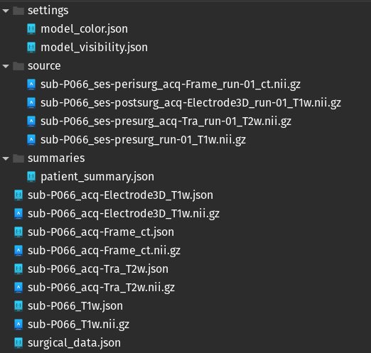

If you have not installed **trajectoryGuide** into 3D Slicer please follow the <a href="https://github.com/trajectoryGuide/widgets/installation.html" target="_blank">installation instructions</a>). 

The first module in **trajectoryGuide** handles the import of patient imaging data. The data should be within a single directory, this directory will be selected within the import window (do not select the files within the directory). During the initial data import for a patient, **trajectoryGuide** will store a copy of the imaging data into a `source` directory as a backup, these files will remain unchanged.

## Load patient directory

An example patient directory is shown below. **trajectoryGuide** will store the imaging data in *NIFTI (Neuroinformatics Technology Initiative)* format, with the file extension `.nii.gz`. If the original imaging data is in DICOM format, the files will be converted to NIFTI (the `source` directory will still contain the original DICOM files).

 

 

You will notice that each imaging file has an associated `.json` file. This file contains metadata associated with the imaging file as it progresses through the **trajectoryGuide** workflow. 

Select the import options prior to loading the patient directory.
    
 

 

* **Implanted Sides:** indicate if the trajectory plan will be unilateral or bilateral
* **Rename Scans:** trajectoryGuide will rename the imaging data to comply with BIDS format, the imaging filenames will be shortened
* **Use Previously Values:** this option is recommended. If the patient directory has already been loaded by trajectoryGuide, then the previous data values will be re-loaded

## Adjust surgical metadata

Once you click `Load Data`, another widget will appear below the patient directory widget. This new widget stores surgical metadata about the patient.

 

 

* **Name**: the identifier given to the patient, the default value will be the name of the patient directory.
* **OR Date:** the date of the surgical intervention.
* **Surgeon:** the name of the surgeon who carried out the surgical intervention. This drop-down box has an option to add additional surgeons.

     

 

    When `Other` is selected, a line edit box will appear to the right. When you finish entering the surgeon name press the `Enter` key.  

* **Target:** the name of the surgical target. This drop-down box has an option to add additional targets. 
    When `Other` is selected, a line edit box will appear to the right. When you finish entering the surgeon name press the `Enter` key.

 
 
 