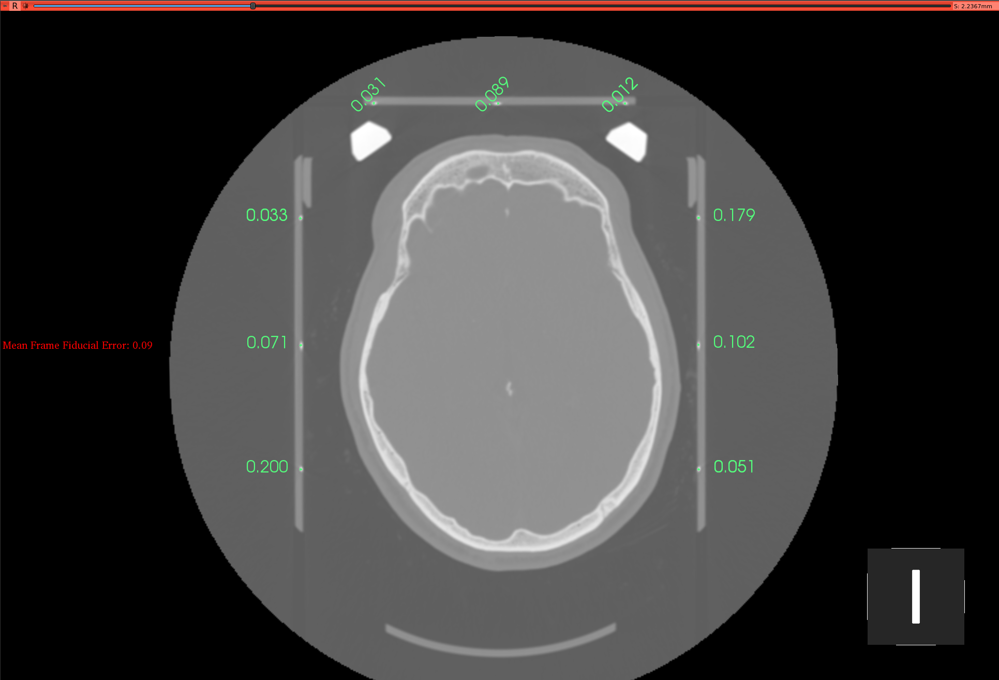

!!! note
    To navigate through the 2D view: 
    **Move across scan**: hold `Shift` while moving the mouse 
    **Zoom in/out**: hold the `right` mouse button while moving mouse up/down (can hold `Control/Command` and scroll)

## Automatic frame detection

Automatic frame detection will only work if the frame was captured with CT. From the drop-down menu, next to `Fiducial Volume`, select the volume containing the stereotactic frame. Choose the stereotactic frame that is captured in the CT volume and press `Detect Frame Fiducials`. 

 

 

If the automatic detection was successful you will see an image like this:

 

 

Scroll up/down the slices to check the accuracy of the frame detection. The labels shown are a combination of the fiducial point number and the Z axis coordinate. You will also notice fiducial points for the frame center and the midpoints of the N-localizer diagonal bars.

If you are satisfied with the results select `Confirm Frame Fiducials`. If you are not satisfied, you can move to the manual frame detection step.

## Manual frame detection

To run manual frame detection select the button `Manual Detection`. You will need to identify each frame fiducial one-by-one. If you are unsure of how the stereotactic frame fiducials are numbered you can press `Frame Fiducial Legend` to see the mapping. All point fiducials will need to be placed on the same axial slice. When you are finished, press 
`Confirm Frame Fiducials`.

 

 

## Leksell frame system

 

 

 
 
 