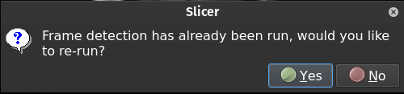
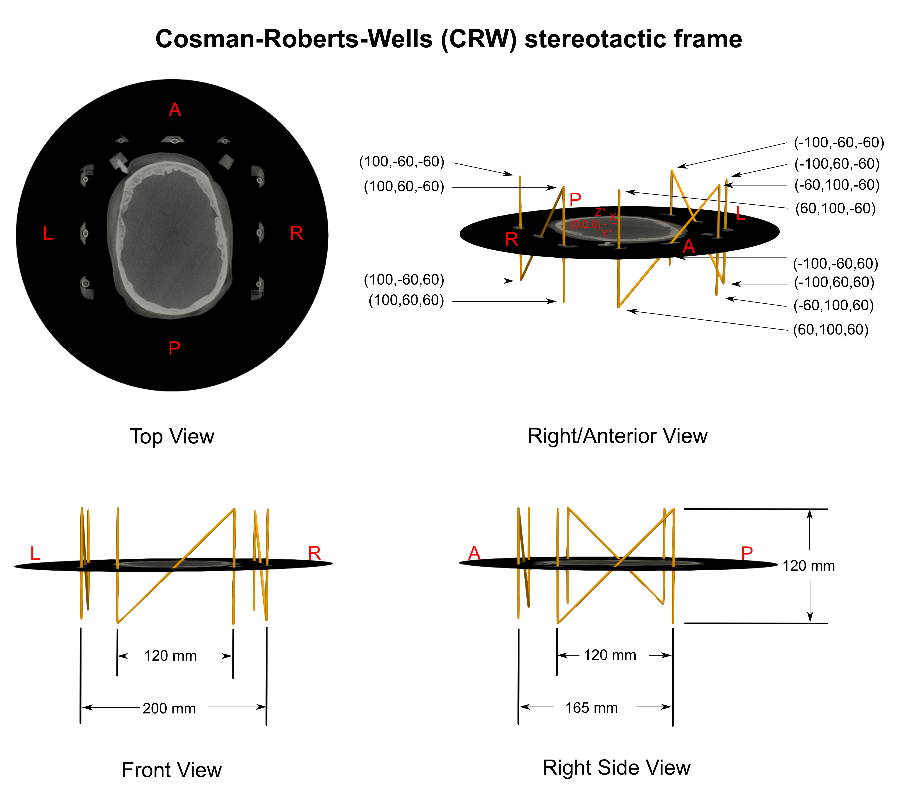
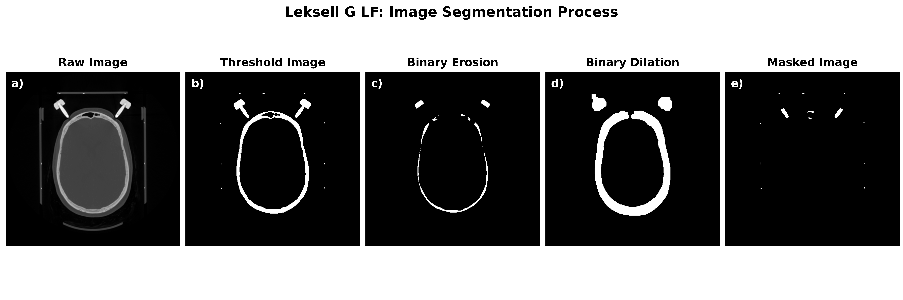
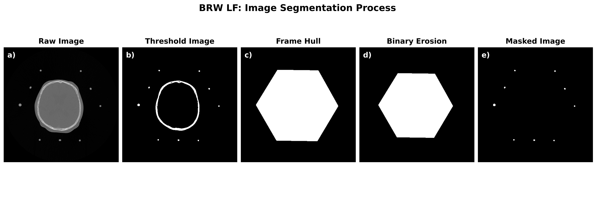
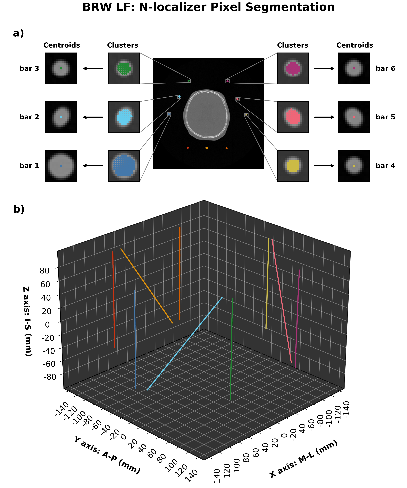
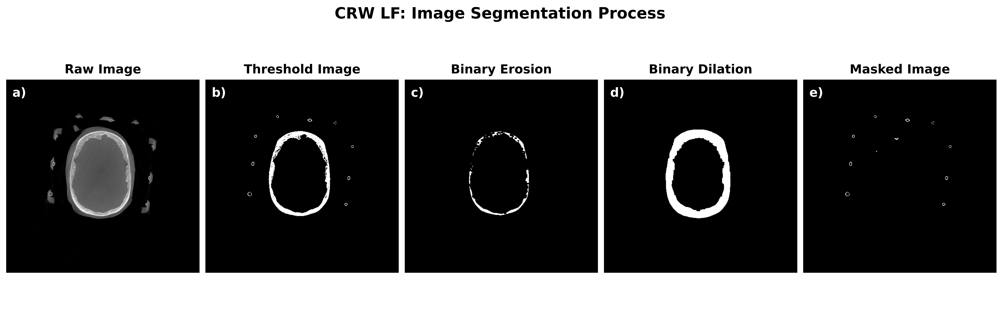
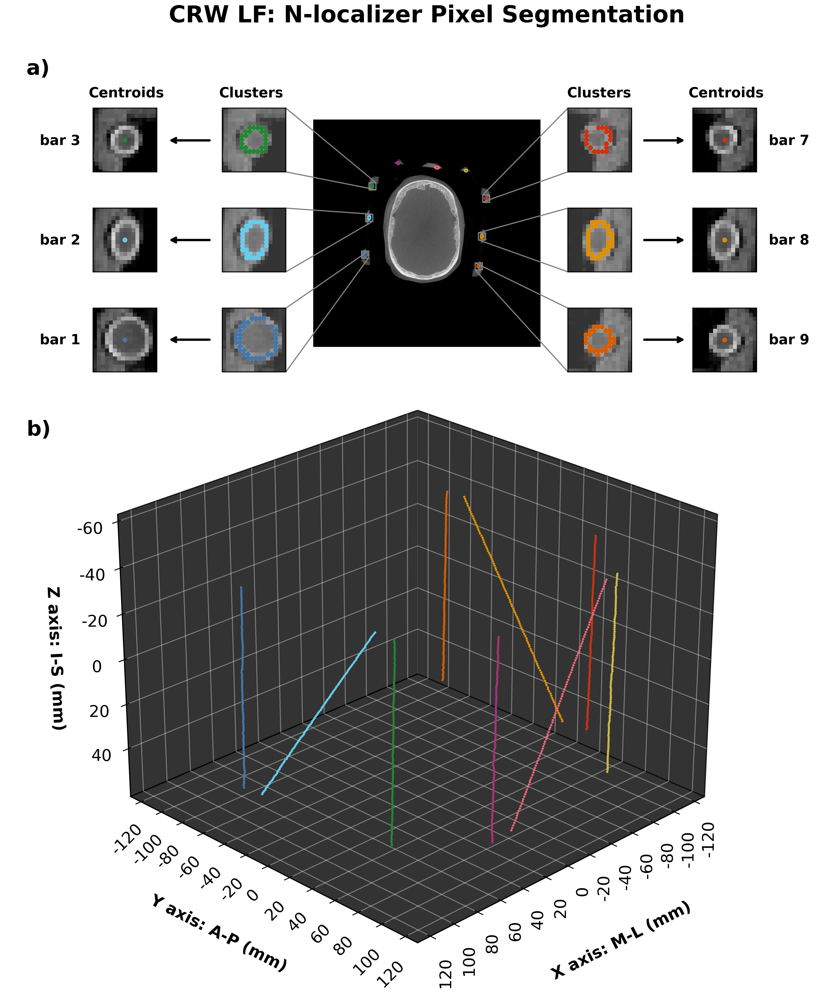

!!! note
    To navigate through the 2D view: 
    &nbsp;&nbsp;&nbsp;&nbsp;**Move crosshairs in all views**: hold `Shift` while moving the mouse 
    &nbsp;&nbsp;&nbsp;&nbsp;**Zoom in/out**: hold the `right` mouse button while moving mouse up/down (can hold `Control/Command` and scroll) 
    &nbsp;&nbsp;&nbsp;&nbsp;**Pan (translate) scan**: hold `middle-mouse button` while moving the mouse 

## Automatic frame detection

&emsp;&emsp;Automatic frame detection will work for CT and MRI. From the drop-down menu, next to `Fiducial Volume`, select the volume containing the stereotactic frame. Choose the stereotactic frame that is captured in the CT volume and press `Detect Frame Fiducials`. 

    <figure>
        
        <figcaption>Frame detection widget interface.</figcaption>
    </figure>

 

If the automatic detection was successful you will see an image like this:

    <figure>
        
        <figcaption>Frame fiducials with frame registration errors.</figcaption>
    </figure>

&emsp;&emsp;Scroll up/down the slices to check the accuracy of the frame detection. The displayed numbers are the fiducial registration errors, lower values indicate a more accurate registration. Values lower than 0.5mm appear in **Green**, while values above 0.5mm appear in **Red**. On the left-hand side you will see the overall frame registration error (anything below 0.5 mm should be acceptable).

&emsp;&emsp;If you are satisfied with the results, select **Confirm Frame Fiducials**. If you are not satisfied, you can try adjusting frame registration settings and re-run autodection (see ensuing section).

## Adjust frame registration settings

You can modify the default frame registration settings by clicking the **Advanced Settings** box in the frame detection widget.

    <figure>
        
        <figcaption>Frame detection advanced settings.</figcaption>
    </figure>

* **Transform type (default: Rigidbody):** Rigidbody, Similarity, Affine.
* **Iterations (default: 100):** Set the maximum number of iterations.
* **Max Landmarks (default: 200):** Set the maximum number of frame fiducials to use, each slice in the CT scan contains a set of fiducial points. For instance, if a CT scan is acquired with 124 slices, using a Leksell frame, there would be ~ 600 fiducial points.
* **Match Centroids (default: No):** Starts the process by translating source centroid to target centroid.
* **Reverse Source/Target (default: No):** Will invert the transform so the source is fixed and the target is floating. This is helpful if the target has fewer data samples than the source.
* **Target Point Radius (default: 0.5 mm):** Radius to use for the target frame fiducials.
* **Mean Distance Measure (Default: RMS):** metric to use when measuring the point registration error.

### Troubleshooting automatic frame detection

&emsp;&emsp;The first parameter to adjust would be **Match Centroids**, select **Yes**. A pop-up message will appear asking if you want to overwrite the previous frame registration data, select **Yes**:

    <figure>
        
        <figcaption>Frame detection pop-up message.</figcaption>
    </figure>

&emsp;&emsp;If you are still not happy with the registration, try increasing the number of iterations to 200 and re-run. The other parameter you can adjust is the number of iterations, increasing the value to 300. You may also want to try decreasing the radius of the target by 0.1 mm. The last choice would be to adjust the transform type, however this will introduce some non-linearity into the registration.

## Manual frame detection

&emsp;&emsp;To run manual frame detection select the button **Manual Detection**. You will need to identify each frame fiducial one-by-one on the same axial slice. If you are unsure of how the stereotactic frame fiducials are numbered you can press `Frame Fiducial Legend` to see the mapping. All point fiducials will need to be placed on the same axial slice. When you are finished, press **Confirm Frame Fiducials**.

    <figure>
        
        <figcaption>Manual frame detection fiducials.</figcaption>
    </figure>

## Supported Frame Systems

### Leksell frame localizer

    <figure>
        
        <figcaption>Leksell stereotactic system.</figcaption>
    </figure>

### BRW frame localizer

    <figure>
        
        <figcaption>BRW stereotactic system.</figcaption>
    </figure>

### CRW frame

    <figure>
        
        <figcaption>CRW stereotactic system.</figcaption>
    </figure>

## Automatic frame detection algorithm

&emsp;&emsp;The automatic frame detection algorithm first employs an intensity threshold to identify pixel clusters that may belong to an N-localizer. After the entire image volume is scanned, the identified clusters are either accepted or rejected based on the stereotactic frame geometry. The intensity threshold is a binary threshold that results in pixel values less than a specified intensity value to be removed (i.e. brain tissue will be removed). For the Leksell and CRW frame systems, a morphological erosion step is applied to the threshold image followed by a morphological dilation. Erosion of a binary image sharpens the boundaries of foreground pixels, which will act to make features in the image volume “thinner”. The resulting image will contain frame and skull artifact but the frame fiducial markers will no longer be present. To finalize the image mask, a morphological dilation step is applied to the eroded image to enlarge the remaining structures in the image. Since the frame fiducial markers were removed with the erosion step, the objects being enlarged are left-over artifact to be removed - which forms the final image mask. The image mask is inverted and intersected with the threshold image to recover the fiducial markers.

&emsp;&emsp;The resulting masked image is processed further to obtain connected components (i.e. neighbouring pixels that share the same value). As long as neighbouring pixels share the same value, they will be labelled as a single region. All connected regions are assigned the same integer value to form clusters of connected pixels. Since the dimensions of the N-localizer are known the expected pixel cluster size can be estimated.

### Leksell localization sample

    <figure>
        
    </figure>

    <figure>
        
    </figure>

### BRW localization sample

    <figure>
        
    </figure>

    <figure>
        
    </figure>

### CRW localization sample

    <figure>
        
    </figure>

    <figure>
        
    </figure>

 
 
 