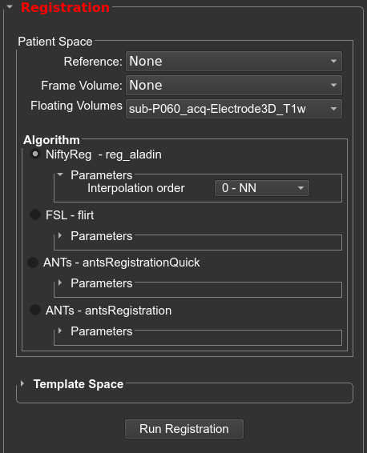
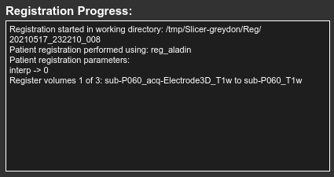
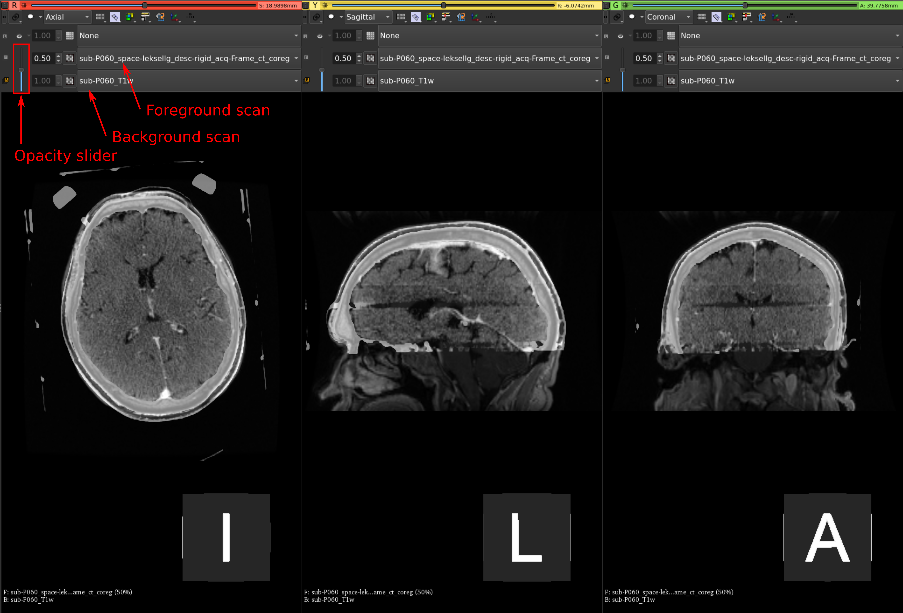
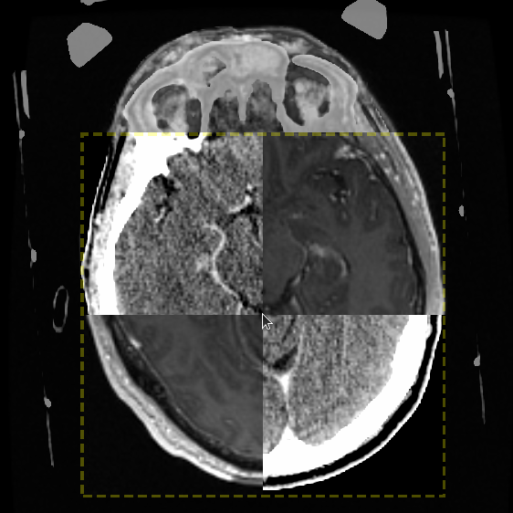

## Patient Space Registration

All registrations with patient scans will be rigid registrations. With some of the more advanced algorithms you can override this and run non-linear registration but it is strongly discouraged. See the below [**Algorithms**](05_registration.html#algorithm) to learn more about each algorithm and the respective settings.

    <figure>
        
        <figcaption>Patient space registration settings.</figcaption>
    </figure>

### Registration Settings

* **Reference Volume:** the scan that all other scans will be registered to (generally the pre-operative T1w scan).
* **Frame Volume:** the scan that contains the sterotactic frame (either MRI or CT).
* **Floating volumes:** the scans that will be co-registered to the reference volume. You can un-check any scans you do not want registered, all scans checked in this drop-down box will be registered.

Within the **Reference Volume** drop-down box, select the scan you want to co-register all other scans to (Reference). In the **Frame Volume** drop-down box, select the scan that contains the stereotactic fiducials. In the **Floating Volumes** drop-down box, all other scans (floating) will be checked to indicate they will be registered to the reference. If there are any floating scans you do not want registered, uncheck them.

    <figure>
        
        <figcaption>Patient space drop-down volume boxes.</figcaption>
    </figure>

To begin the registration, press the **Run Registration** button. The **Registration Process** box will display updated information during the registration. When the registration is complete, the view will be automatically changed to a compare view.

    <figure>
        
        <figcaption>Patient space drop-down volume boxes.</figcaption>
    </figure>

### Check Registration Results

For each registration you will either select **Confirm Registration** or **Decline Registration**. If you choose to decline a registration, the registration can be re-run with a different algorithm. To check the registration, it is helpful to use the opacity slider to change the opacity of the foreground scan (floating scan).

    <figure>
        
        <figcaption>Patient space drop-down volume boxes.</figcaption>
    </figure>

You can also use the **Layer Reveal** tool to check the registration in more detail. This tool displays a square that contains half the foreground scan and half the background scan.

    <figure>
        
        <figcaption>Registration layer reveal tool.</figcaption>
    </figure>

When finished checking the registrations, any confirmed registered scans will disappear from the **Floating Volumes** drop-down box, declined scans will still appear in the drop-down box. To re-run the registration, update any settings and press the **Run Registration** button, all previous registration information, for the current floating scans, will be erased.

## Algorithms

The default algorithm will be NiftyReg using nearest neighbor interpolation when applying the transform. You are able to change the registration algorithm and parameters according to the following information.

### NiftyReg - reg_aladin

For information about this algorithm you can visit <a href="https://www.nitrc.org/projects/niftyreg/" target="_blank">this page</a>.

* **interpolation order:** nearest neighbor, cubic, sinc, linear (default nearest neighbor)

### ANTS - antsRegistrationSyNQuick

* **transform type:** rigid, rigid+affine, rigid+affine+syn, rigid+syn, rigid+affine+b-spl syn, rigid+b-spl syn
    - **rigid:** rigid (1 stage)
    - **rigid+affine:** rigid + affine (2 stages)
    - **rigid+affine+syn:** rigid + affine + deformable syn (3 stages)
    - **rigid+syn:** rigid + deformable syn (2 stages)
    - **rigid+affine+b-spl syn:** rigid + affine + deformable b-spline syn (3 stages)
    - **rigid+b-spl syn:** rigid + deformable b-spline syn (2 stages)
* **threads:** number of threads to use
* **cc radius:** histogram bins for mutual information in SyN stage (default = 32)
* **spline distance:** spline distance for deformable B-spline SyN transform (default = 26)
* **histogram matching:** use histogram matching (default = 0)

### FSL - flirt

For information about this algorithm you can visit <a href="https://fsl.fmrib.ox.ac.uk/fsl/fslwiki/FLIRT/UserGuide" target="_blank">this page</a>.

* **interpolation order:** nearest neighbor, spline, sinc, trilinear (default trilinear)
* **cost:** used during the second stage. Options are: mutual info, correlation ratio, least square, normalized correlation, normalized mutual info (default corratio)
* **search cost:** used during initial search stage. Options are: mutual info, correlation ratio, least square, normalized correlation, normalized mutual info (default corratio)
* **coarse search:** search delta angle to use during initial alignment between the images (default 60)
* **fine search:**  search delta angle to use during final alignment between the images (default 18)

### ANTS - antsRegistration

For information about this algorithm you can visit <a href="https://www.nitrc.org/projects/ants" target="_blank">this page</a>.

This algorithm gives the user more control over each step. The user can specify the "stages" of registration, where a stage consists of a transform and an image metric. Each stage consists of levels with specific values set for iterations, shrink factors, and smoothing sigmas.

* **interpolation:** applied only to the output image. Options are: linear, nearest neighbor, bspline, cosinc, hammingsinc  (default nearest neighbor)
* **metric:** CC,MI,GC   (CC)
    - **CC:** ANTS neighborhood cross correlation
    - **MI:** Mutual information
    - **GC:** Global Correlation
* **gradient step:** how big the mutual info, correlation ratio, least square, normalized correlation, normalized mutual info  (default 0.1)
* **convergence:** for each hierarchical step, this value specifies the threshold that is needed to be met before stopping the respective step  (default 1000x500x250x100x0,1e-6,10)
* **shrink:** shrink factor for each hierarchical step  (default 8x4x2x2x1)
    - i.e. for an image with 256x256x256 voxels, the levels will work on images of size 32mm, 64mm, 128mm, and 256mm
* **smoothing:** smoothing factor applied in each hierarchical step  (default 3x2x1x0x0vox)

## Template Space Registration

Click `Run Registration`. The registration progression will be updated within the `Registration Progress` window. Once registration is completed, you will see the co-registered volumes appear in the floating drop-down box (under `Co-registered Volumes`).

You will now confirm that the registration results by clicking the `Compare Volumes` button. For each registration you will either select `Confirm Registration` or `Decline Registration`. If you choose to decline a registration, you will be able to re-run the registration with a different algorithm.

 
 
 