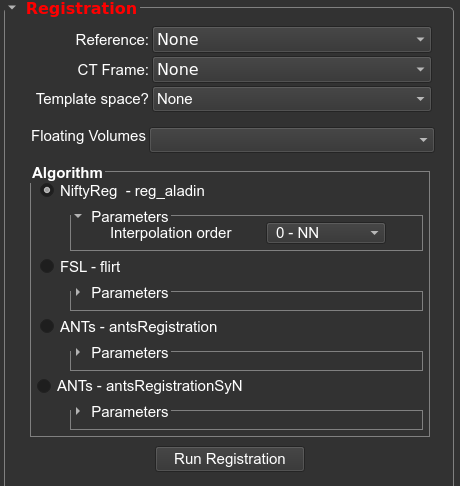

## Registration settings

* **Reference Volume:** the imaging volume that all other images will be registered to.
* **CT Frame:** the imaging volume contains the sterotactic frame.
* **Template Space (optional):** select the template space to be registered to the patients space. 
* **Floating volumes:** the imaging volumes that will be co-registered to the reference volume. You can un-check any imaging volumes you do not want registered.

## Choose registration algorithm

### NiftyReg - reg_aladin

* **interpolation order:** nearest neighbor, cubic, sinc, linear (default nearest neighbor)

### FSL - flirt

* **interpolation order:** nearest neighbor, spline, sinc, trilinear (default trilinear)
* **cost:** mutual info, correlation ratio, least square, normalized correlation, normalized mutual info (default corratio)
* **search cost:** mutual info, correlation ratio, least square, normalized correlation, normalized mutual info (default corratio)
* **coarse search:** search delta angle to use during initial grid search (default 60)
* **fine search:**  search delta angle to use during final grid search (default 18)

### ANTS - antsRegistration

This algorithm gives the user more control over each step. The user can specify the "stages" of registration, where a stage consists of a transform and an image metric. Each stage consists of levels with specific values set for iterations, shrink factors, and smoothing sigmas.

* **interpolation:** applied only to the output image. Options are: linear, nearest neighbor, bspline, cosinc, hammingsinc  (default nearest neighbor)
* **metric:** CC,MI,GC   (CC)
    - **CC:** ANTS neighborhood cross correlation
    - **MI:** Mutual information
    - **GC:** Global Correlation
* **gradient step:** how big the mutual info, correlation ratio, least square, normalized correlation, normalized mutual info  (default 0.1)
* **convergence:** for each hierarchical step, this value specifies the threshold that is needed to be met before stopping the respective step  (default 1000x500x250x100x0,1e-6,10)
* **shrink:** shrink factor for each hierarchical step  (default 8x4x2x2x1)
    - i.e. for an image with 256x256x256 voxels, the levels will work on images of size 32mm, 64mm, 128mm, and 256mm
* **smoothing:** smoothing factor applied in each hierarchical step  (default 3x2x1x0x0vox)

### ANTS - antsRegistration
* **transform type:** rigid, rigid+affine, rigid+affine+syn, rigid+syn, rigid+affine+b-spl syn, rigid+b-spl syn
    - **rigid:** rigid (1 stage)
    - **rigid+affine:** rigid + affine (2 stages)
    - **rigid+affine+syn:** rigid + affine + deformable syn (3 stages)
    - **rigid+syn:** rigid + deformable syn (2 stages)
    - **rigid+affine+b-spl syn:** rigid + affine + deformable b-spline syn (3 stages)
    - **rigid+b-spl syn:** rigid + deformable b-spline syn (2 stages)
* **threads:** number of threads to use
* **cc radius:** histogram bins for mutual information in SyN stage (default = 32)
* **spline distance:** spline distance for deformable B-spline SyN transform (default = 26)
* **histogram matching:** use histogram matching (default = 0)

## Run registration algorithm

Click `Run Registration`. The registration progression will be updated within the `Registration Progress` window. Once registration is completed, you will see the co-registered volumes appear in the floating drop-down box (under `Co-registered Volumes`).

You will now confirm that the registration results by clicking the `Compare Volumes` button. For each registration you will either select `Confirm Registration` or `Decline Registration`. If you choose to decline a registration, you will be able to re-run the registration with a different algorithm.

 
 
 