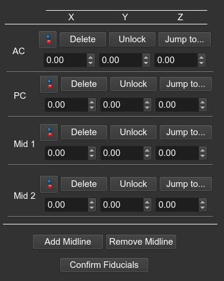
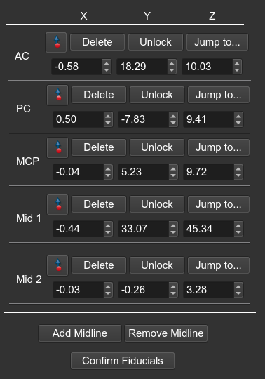
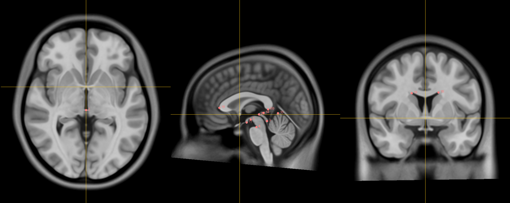
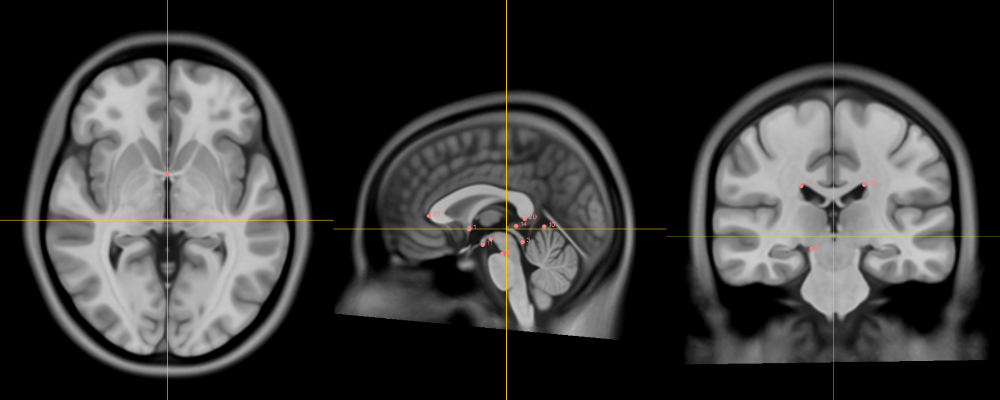
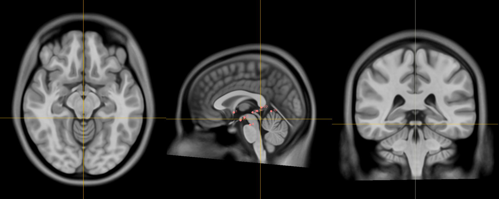
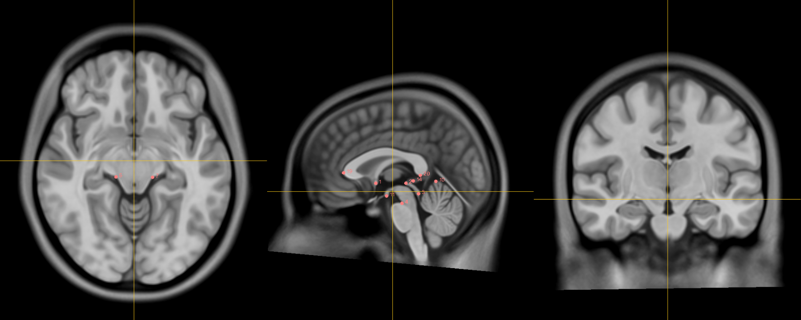

!!! note
    To navigate through the 2D view: 
    &nbsp;&nbsp;&nbsp;&nbsp;**Move crosshairs in all views**: hold `Shift` while moving the mouse 
    &nbsp;&nbsp;&nbsp;&nbsp;**Zoom in/out**: hold the `right` mouse button while moving mouse up/down (can hold `Control/Command` and scroll) 
    &nbsp;&nbsp;&nbsp;&nbsp;**Pan (translate) scan**: hold `middle-mouse button` while moving the mouse 

## Placing Fiducials

The midline plane will need to be determined, which relies on four points: the anterior commissure (AC), the posterior commissure (PC), and two midline points (Mid1-2). The midline points should be at least one interhemispheric point and one brainstem point (see section below for landmark positions). These 4 points are then used to define the midline plane, which is used to define the Talaraich coordinate system.

To place a fiducial point, click on the place point button () and drop the point at the indicated landmark. Once you have placed AC, PC and at least 2 midlines, clikc **Confirm Fiducials**. A new entry will be added to the fiducial table for the point `MCP`.

    <figure>
    
    <a style="font-size: 36px;">&rarr;</a>
    
    </figure>

 

!!! warning
    If you modify any fiducial points you will need to press **Confirm Fiducials** again to re-calculate `MCP`

## Anatomical Landmarks

### AC point

    <figure>
        
        <figcaption>The anterior commissure.</figcaption>
    </figure>

### PC point

    <figure>
        
        <figcaption>The posterior commissure.</figcaption>
    </figure>

### Midline Points

#### Infracollicular Sulcus

    <figure>
        
        <figcaption>The infracollicular sulcus.</figcaption>
    </figure>

#### Superior interpeduncular fossa

    <figure>
        
        <figcaption>The superior interpeduncular fossa.</figcaption>
    </figure>

 
 
 