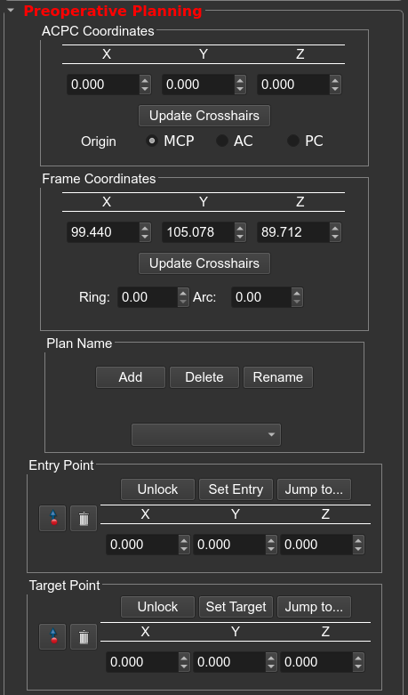

!!! note
    To navigate through the 2D view: 
    &nbsp;&nbsp;&nbsp;&nbsp;**Move crosshairs in all views**: hold `Shift` while moving the mouse 
    &nbsp;&nbsp;&nbsp;&nbsp;**Zoom in/out**: hold the `right` mouse button while moving mouse up/down (can hold `Control/Command` and scroll) 
    &nbsp;&nbsp;&nbsp;&nbsp;**Pan (translate) scan**: hold `middle-mouse button` while moving the mouse 

## Adding/Modifying a Plan

&emsp;&emsp;The planning module contains two coordinate groupboxes, one for ACPC space and the other for stereotactic space. The coordinates are linked to the position of the crosshairs, when the crosshairs move the coordinates are updated in real-time.

    <figure>
        
        <figcaption>The preop planning module.</figcaption>
    </figure>

&emsp;&emsp;**trajectoryGuide** links objects and data in the scene to the plan name. When you switch between plans, the values in the coordinate boxes will update to the current plan values. Before setting a target/entry, you will need to add a new plan. Click `Add` in the **Plan Name** groupbox and set a name for the current plan. Defining the entry/target point is similar to the previous **Anatomical fiducials widget** except you can also enter exact coordinate values into the ACPC/Stereotactic space coordinate boxes and press "Update Crosshairs" to move the crosshairs to the specified coordinates.

!!! warning
	* Only enter stereotactic based coordinates into the stereotactic coordinate boxes 
	* Only enter ACPC based coordinates into the ACPC space boxes