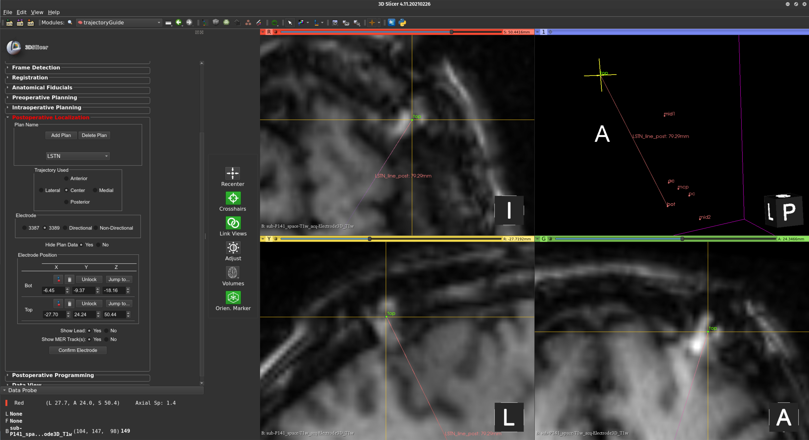

## Locating postoperative electrode

For now, electrode localization in trajectoryGuide is achieved by manually defining the bottom and top of each electrode. The user should place the postoperative imaging volume (CT and/or MRI) inside the patient folder, re-load trajectoryGuide, and run the registration step. Once the postoperative volume is aligned with the reference image volume it can be used to locate the electrode(s).

&emsp;&emsp;The user must indicate the plan that is associated with the electrode being localized. If only postoperative localization is being performed for the patient a plan name can be defined within this module. The user is then asked to place a fiducial marker at the very tip of the electrode to mark the “target” and another fiducial point near where it exists from the skull to indicate the “entry” point. Once the two points are placed the “Confirm Electrode” button can be pressed and the postoperative electrode will be rendered in the 2D and 3D views.

    <figure>
        
        <figcaption>The postop localization module.</figcaption>
    </figure>

