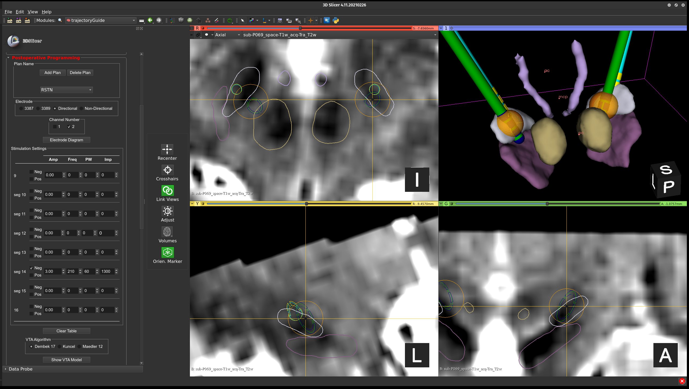

# Volume of activated tissue

The volume of activated tissue (VAT) also referred to as the volume of tissue activated (VTA) is a model the predicts the extent and location of neural activation produced by stimulation. In trajectoryGuide, the model proposed by Dembek et al. (2017) has been utilized since it does not require image processing to be conducted prior to VAT computation 1. The calculation of the stimulation field radius based on the DBS stimulation parameters is described the following equation:

$$
r=\left ( \frac{pw}{90 \mu s} \right )*\sqrt{0.72\frac{Vm}{A}*\frac{I}{165 V/m}}
$$

&emsp;&emsp;where *pw* is the pulse width (microseconds), *A* is the amplitude of stimulation (voltage or milliamperes), and *I* is the impedance (Ohms) of the electrode contact being used for stimulation. The value *0.72 Vm* is a constant validated by Dembek et al. (2017) in a previous study 1. A more complex stimulation field model will eventually be incorporated into trajectoryGuide that can handle bipolar stimulation. For now, only a monopolar stimulation model can be generated. To generate the VAT models in trajectoryGuide, the user needs to input the stimulation parameters including the active contact, stimulation amplitude, frequency, pulse width, and impedance

    <figure>
    	
        <figcaption>The postop volume of activated tissue module.</figcaption>
    </figure>

1 T. A. Dembek et al., “Probabilistic mapping of deep brain stimulation effects in essential tremor.,” NeuroImage Clin., vol. 13, pp. 164–173, 2017, doi: 10.1016/j.nicl.2016.11.019