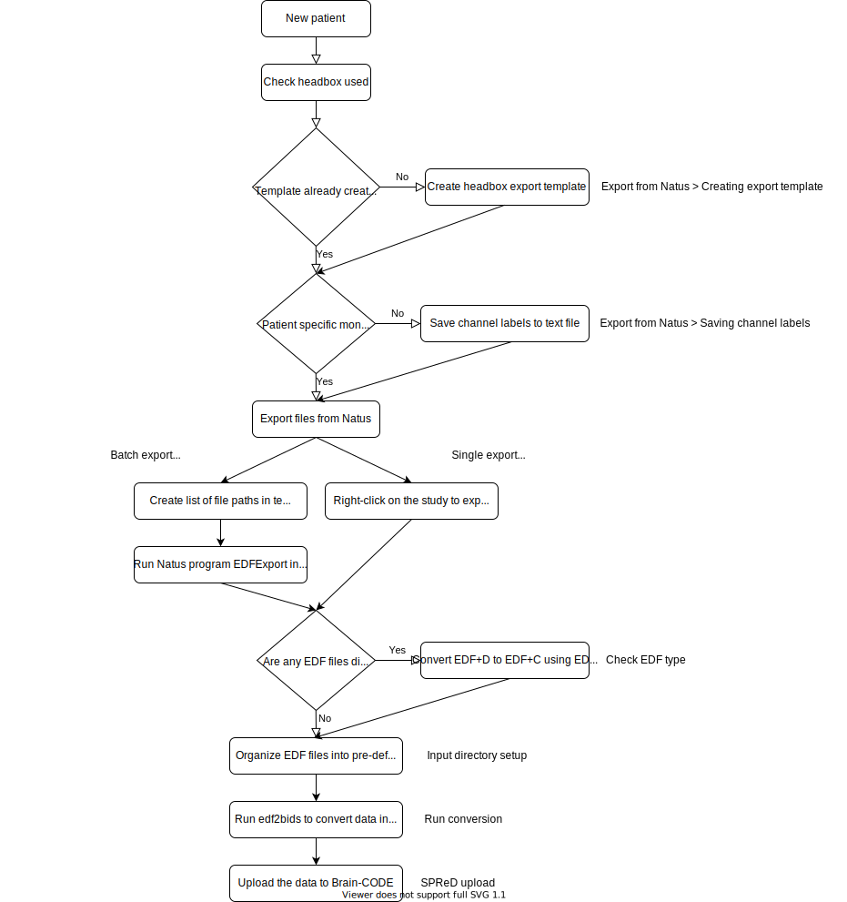

# Overview
This section describes steps required to use **edf2bids**. If you have not installed **edf2bids** you have two options:

  * [Install a compiled version](../installation.html#obtain-pre-compiled-versions)
  * [Compile from source code](../installation.html#compile-from-source)

The following steps should be taken sequentially:

1. [**Export data from Natus**](03_natus_export.html)
2. [**Organize your input directory**](04_input_dir_setup.html#input-directory-setup)
3. [**Check EDF file type**](05_check_edf_type.html)
4. [**Adjust software settings**](06_edf2bids_settings.html#adjusting-metadata-settings)
5. [**Confirm input directory data**](07_run_conversion.html#input-directory-selection)
6. [**Confirm output directory data**](07_run_conversion.html#output-directory-selection)
7. [**Check output folder data**](08_output_structure.html#bids-output-folder-structure)
8. [**Convert/Upload data to SPReD**](09_spred_upload.html#convert-bids-to-spred-format) \[EpLink study only\]

## EpLink Study Workflow

