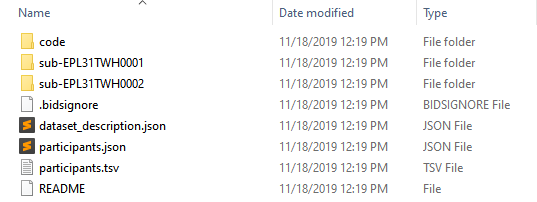
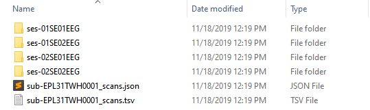
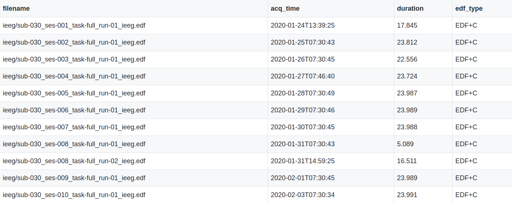
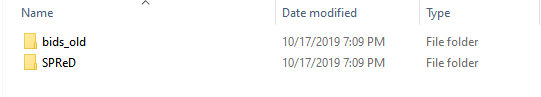
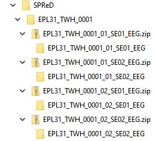
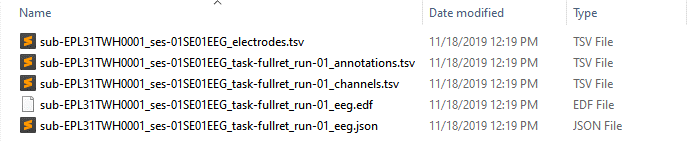

## BIDS directory structure

The output directory will look like the following (each subject having their own directory):

* **code:** this folder will contain the code used to convert the EDF/EDF+ data for each EDF/EDF+ file for the subjects.
* **dataset_description.json:** this file will contain the Json Metadata you previously defined. This is overall information about the dataset
* **participants.tsv:** this file contains a list of all the subjects in the dataset and their general demographics (i.e. age, sex etc.). This file can also be used to store additional subject information that is not variable over the different visits and sessions. 

### Subject directory

#### directory structure

Within each subject directory there will be a different session sub-directory for each day of recording.
  

* **\*_scans.tsv:** this file contains general information about each EDF file for the subject (i.e. filename, recording duration, EDF+ type etc.).

#### \*_scans.tsv content

### Session directory

Within each session sub-directory there will be a modality sub-directory (either eeg/ieeg). Within the modality sub-directory there will be five files, containing different information associated with the specific EDF/EDF+ file.

* **\*_electrodes.tsv:** contains information associated with the electrodes used to collect the data.
* **\*_annotations.tsv:** contains all annotations present in the EDF/EDF+ file, identifiers have been scrubbed.
* **\*_channels.tsv:** contains information about each channel that was used in the recording.
* **\*\_eeg.json/** **or** **\*\_ieeg.json:** contains metadata information about the EDF/EDF+ file.
* **\*\_eeg.edf/** **or** **\*\_ieeg.edf:** contains the data in the de-identified EDF/EDF+ file.

### Example

#### Interactive

## SPReD directory structure

1. When the SPReD conversion is completed a new sub-directory will be created in the output directory. All unused BIDS files will be transferred to the **bids_old** suu-directory, while all the SPReD files will be moved to the **SPReD** sub-directory.

    

2. The **SPReD** sub-directory will look like:

    

3. Within each sub-directory of the **.zip** folders the same files from the BIDS output will be found:

    

4. You will be uploading the **.zip** directories to Brain-CODE.

 
 
 
